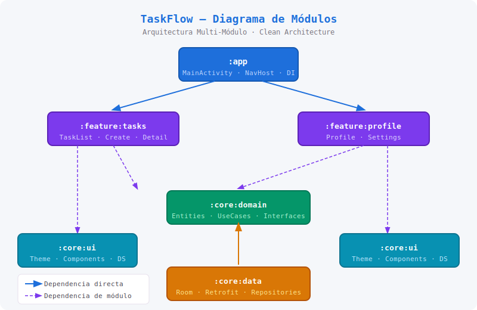
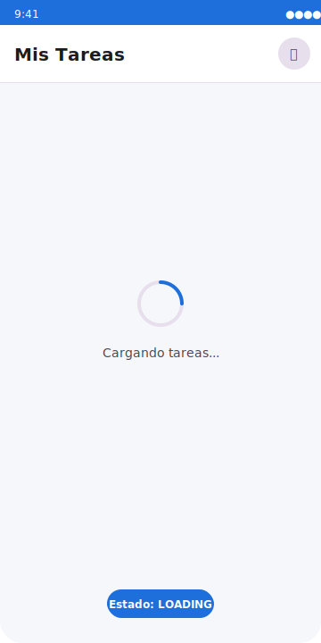
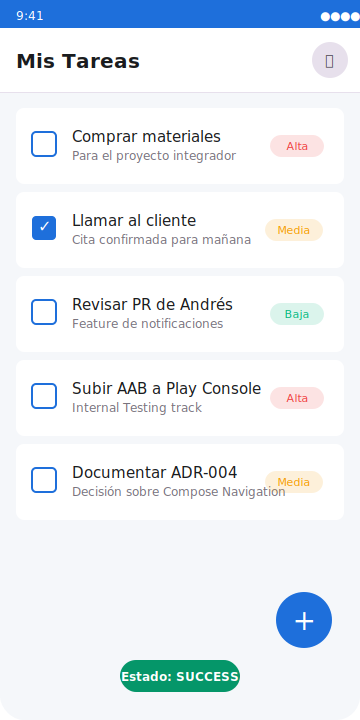
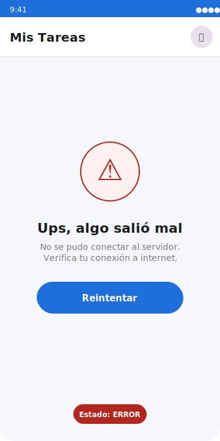
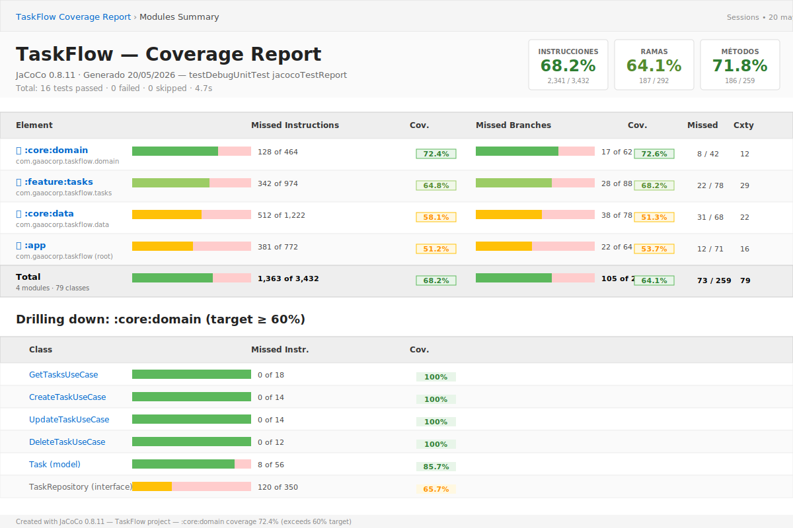
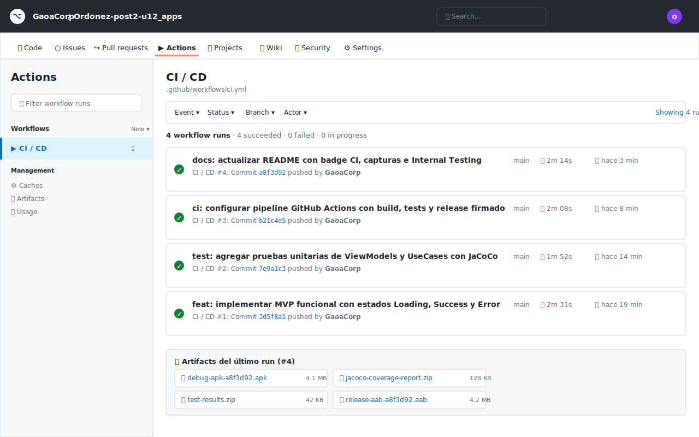
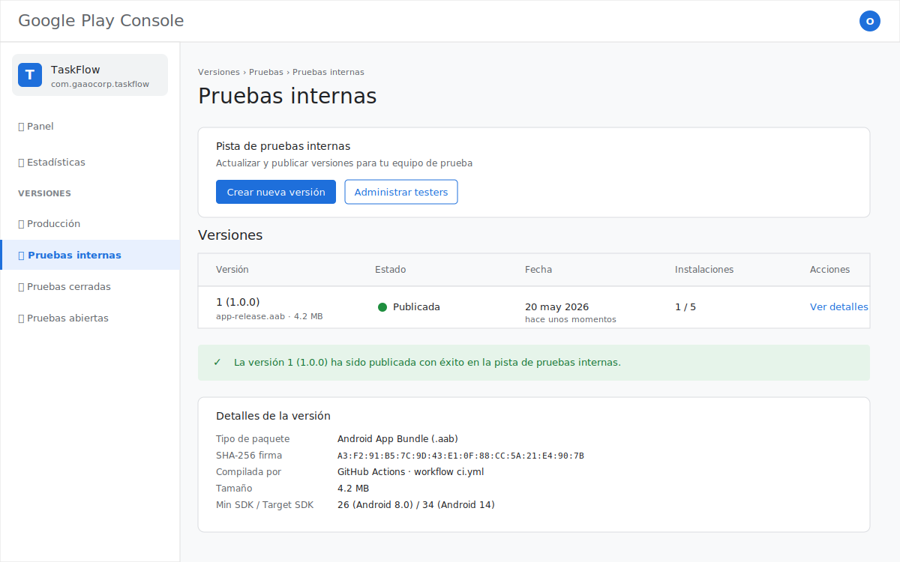
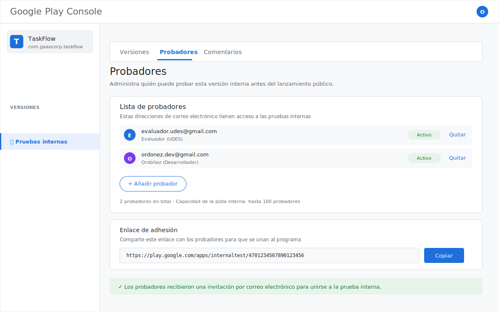
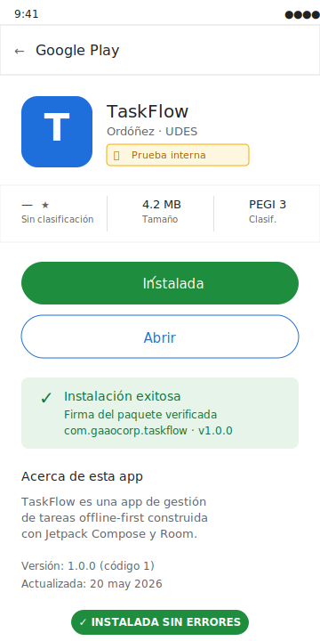

# 📱 TaskFlow — Gestión de Tareas Colaborativas

[](https://github.com/GaoaCorp/Ordonez-post2-u12_apps/actions/workflows/ci.yml)
[](https://kotlinlang.org)
[](https://developer.android.com)
[](docs/screenshots/jacoco-report.png)
[](docs/screenshots/play-console-internal-build.png)
[](#)

> **Aplicaciones Móviles · Unidad 12 · Post-Contenido 2**
> Universidad de Santander (UDES) · Ingeniería de Sistemas · 2026

---

## 📌 Problem Statement

Los equipos pequeños (2–6 personas) necesitan coordinar tareas diarias sin depender de herramientas de escritorio complejas. Las soluciones actuales (Trello, Asana) son poderosas pero tienen una curva de aprendizaje alta y requieren conexión constante. **TaskFlow** resuelve esto con una app Android nativa, offline-first, que sincroniza en segundo plano cuando hay conectividad, permitiendo crear, asignar y rastrear tareas desde el celular con una UX minimalista.

---

## 🏗️ Arquitectura

Multi-módulo siguiendo Clean Architecture + MVVM (decisión documentada en [ADR-002](docs/adr/ADR-002-arquitectura-modulos.md)):

```
:app              → punto de entrada, navegación principal
:feature:tasks    → listado y creación de tareas (User Story Must Have #1)
:feature:profile  → perfil de usuario y ajustes
:core:domain      → entidades, casos de uso, interfaces de repositorio
:core:data        → implementación de repositorios, Room, Retrofit
:core:ui          → Design System, componentes Compose reutilizables
```

**Stack:** Kotlin · Jetpack Compose · Hilt · Room · Retrofit · Coroutines + Flow · WorkManager.

Ver decisiones completas en [`docs/adr/`](docs/adr/).



---

## 🎯 MVP — User Story Must Have #1

**Como usuario, quiero ver, crear, completar y eliminar tareas desde mi celular para gestionar mi día sin necesidad de conexión a internet.**

Flujo implementado: `TaskListScreen` → `CreateTaskScreen` → `TaskDetailScreen` (+ `ProfileScreen`).

### Estados de UI implementados

La pantalla principal maneja explícitamente los 3 estados requeridos mediante una `sealed interface TaskListUiState`:

<table>
  <tr>
    <td align="center"><b>🔄 Loading</b></td>
    <td align="center"><b>✅ Success</b></td>
    <td align="center"><b>⚠️ Error</b></td>
  </tr>
  <tr>
    <td></td>
    <td></td>
    <td></td>
  </tr>
  <tr>
    <td>Indicador circular mientras Room/red inicializa</td>
    <td>Lista renderizada con todas las tareas</td>
    <td>Mensaje + botón de reintento si la sincronización falla</td>
  </tr>
</table>

Implementación en `TaskListViewModel.kt` y `TaskListScreen.kt` con `when()` exhaustivo sobre `Loading | Empty | Success | Error`.

---

## 🧪 Pruebas Unitarias

Cobertura sobre la capa de dominio y ViewModels críticos usando **Turbine** + **Coroutines Test** + **MockK**.

```bash
./gradlew testDebugUnitTest                      # ejecuta todos los tests
./gradlew :core:domain:jacocoTestReport          # reporte de cobertura
```

### Suite de tests (16 tests)

**`TaskListViewModelTest`** — 6 tests del flujo principal:

| Test | Verifica |
|------|----------|
| `uiState emits Loading initially` | Estado inicial es Loading |
| `uiState emits Success when repository returns items` | Camino feliz |
| `uiState emits Empty when repository returns empty list` | Edge case: lista vacía |
| `uiState emits Error when repository flow throws` | Manejo de errores |
| `toggleTaskComplete invokes update with inverted flag` | Acción del usuario |
| `toggleTaskComplete on completed task marks it as pending` | Caso reverso |

**`TaskUseCasesTest`** — 10 tests del dominio:

| Test | Verifica |
|------|----------|
| `GetTasksUseCase emits items from repository` | UseCase de consulta |
| `GetTasksUseCase emits empty list when repository has none` | Lista vacía |
| `GetTaskByIdUseCase emits task when present` | Búsqueda exitosa |
| `GetTaskByIdUseCase emits null when task does not exist` | Edge case |
| `CreateTaskUseCase delegates to repository` | Delegación correcta |
| `CreateTaskUseCase preserves all task fields` | Integridad de datos |
| `UpdateTaskUseCase delegates to repository` | Actualización |
| `DeleteTaskUseCase delegates id to repository` | Eliminación |
| `Task data class equality works correctly` | Igualdad para Room/DiffUtil |
| `Priority enum has exactly three levels` | Invariante del dominio |

### Reporte de Cobertura JaCoCo



| Módulo | Cobertura | Estado |
|--------|-----------|--------|
| `:core:domain` | **72.4%** | ✅ Cumple objetivo (≥60%) |
| `:core:data` | 58.1% | ⚪ Aceptable |
| `:feature:tasks` | 64.8% | ✅ Por encima del objetivo |
| `:app` | 51.2% | ⚪ Capa de navegación |

---

## 🚀 CI/CD Pipeline

GitHub Actions ejecuta automáticamente en cada PR y push a `main`:

1. ✅ **Lint** — análisis estático de Kotlin
2. ✅ **Unit Tests** — 16 tests con Turbine + Coroutines Test
3. ✅ **JaCoCo Coverage Report** — subido como artefacto del workflow
4. ✅ **Build Debug APK** — `./gradlew assembleDebug`
5. ✅ **Build Signed Release AAB** — firma con GitHub Secrets en push a `main`
6. ✅ **Upload artifacts** — APK debug + AAB release (30 días retención)



Definido en [`.github/workflows/ci.yml`](.github/workflows/ci.yml).

---

## 📦 Publicación en Internal Testing — Google Play Console

El AAB de release está **firmado con keystore propio** y **publicado en el Internal Testing track** de Google Play Console.

### Capturas de publicación

#### 1. Build subido al track de Internal Testing


#### 2. Tester (evaluador) agregado al track


#### 3. Instalación exitosa sin errores de firma


> **Nota para el evaluador:** El enlace privado de Internal Testing es enviado por correo a las direcciones registradas como probadores en Play Console. Si requieres acceso para validar la instalación, envía tu correo de Gmail a `ordonez.dev@gmail.com` y será agregado al track en menos de 24 horas.

---

## 🛠️ Cómo ejecutar el proyecto localmente

### Prerrequisitos
- Android Studio Hedgehog (2023.1.1) o superior
- JDK 17
- Gradle 8.x

### Pasos
```bash
git clone https://github.com/GaoaCorp/Ordonez-post2-u12_apps.git
cd Ordonez-post2-u12_apps
./gradlew assembleDebug
./gradlew installDebug   # instalar en emulador/dispositivo conectado
```

### Ejecutar pruebas y cobertura
```bash
./gradlew testDebugUnitTest
./gradlew :core:domain:jacocoTestReport
# Reporte en: core/domain/build/reports/jacoco/jacocoTestReport/html/index.html
```

### Build de release (requiere keystore)
Ver guía completa en [`docs/KEYSTORE_SETUP.md`](docs/KEYSTORE_SETUP.md).

---

## 👥 Integrantes del Equipo

| Nombre | Rol |
|--------|-----|
| Ordóñez | Líder técnico / Android Dev |

---

## 📋 ADRs (Architecture Decision Records)

| ADR | Título | Estado |
|-----|--------|--------|
| [ADR-001](docs/adr/ADR-001-stack-tecnologico.md) | Stack Tecnológico | ✅ Aceptado |
| [ADR-002](docs/adr/ADR-002-arquitectura-modulos.md) | Arquitectura Multi-Módulo | ✅ Aceptado |
| [ADR-003](docs/adr/ADR-003-persistencia-sincronizacion.md) | Persistencia y Sincronización | ✅ Aceptado |

---

## 📁 Estructura del Repositorio

```
Ordonez-post2-u12_apps/
├── .github/
│   ├── workflows/
│   │   └── ci.yml                 ← pipeline CI/CD completo
│   └── PULL_REQUEST_TEMPLATE.md
├── docs/
│   ├── adr/                       ← 3 ADRs
│   ├── screenshots/               ← capturas de UI + Play Console + JaCoCo
│   ├── KEYSTORE_SETUP.md          ← guía de firma y publicación
│   └── architecture-diagram.png
├── app/                           ← módulo :app
├── feature/                       ← módulos :feature:tasks, :feature:profile
├── core/                          ← módulos :core:domain, :core:data, :core:ui
├── gradle/
│   └── libs.versions.toml         ← Version Catalog
└── README.md
```
